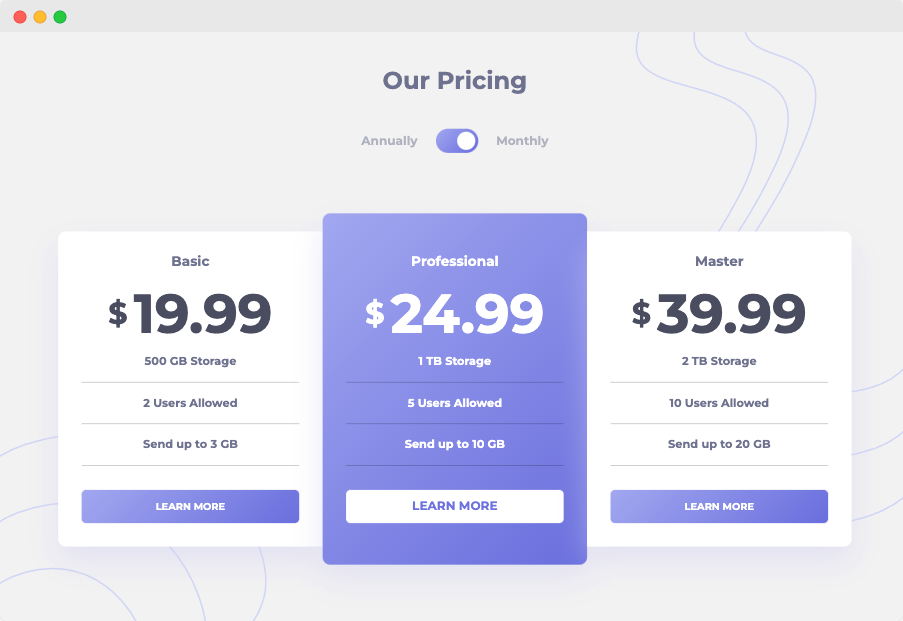

# FrontendMentor Challenge | Pricing Component

This is a challenge from FrontendMentor.   
You can find the description of the task here:  
https://www.frontendmentor.io/challenges/pricing-component-with-toggle-8vPwRMIC



My goal in this challenge was to:
- touch Stylus as css pre-processor and to 
- use gulp as task-runner
- make an accurate estimation for this component

### How to run the 
```bash
git clone https://github.com/jeromehaas/pricing-card-component-fm.git
cd pricing-card-component-fm
nvm use
npm install 
npm start
```